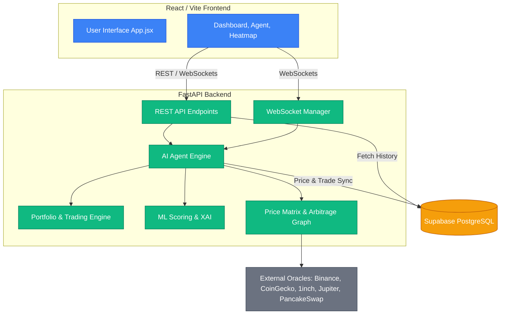

# Arbix — Technical Documentation

## 📐 System Architecture

Arbix operates in an autonomous loop across multiple interconnected domains.



### 🧠 ML Scoring Engine & Execution
We run a complete ML pipeline on every single opportunity detected by the Bellman-Ford engine. Every model was coded from scratch in pure Python without using libraries like sklearn or PyTorch.

Our scoring factors:
*   **Bayesian Calibrator**: Prevents overconfidence after winning streaks by looking at history.
*   **EMA Crossover Signal**: Detects trend direction to avoid trading against momentum.
*   **Ornstein-Uhlenbeck Half-Life**: Measures how fast a quote spread closes and skips opportunities that have too short an execution window.
*   **Mean-Reversion Probability**: Confirms if a spread is structural or just noise.
*   **Volume and Consensus**: Weights oracle data across multiple feeds to reject anomalies.

```python
# The ensemble combines rule-based XAI + ML scores
final_confidence = 0.6 * xai_score + 0.4 * ml_ensemble_score
execute = (final_confidence >= 35) and (risk_score <= 80)
```


## 🔗 Deployed Smart Contracts (BSC Testnet)

All 3 contracts are **live on BSC Testnet (Chain ID 97)** with verified on-chain transactions:

| Contract | Address | BscScan |
|---|---|---|
| **ArbixPriceOracle** | `0x73764D77B6736a2643Ea6fB773AeBb79FaFc7a83` | [View ↗](https://testnet.bscscan.com/address/0x73764D77B6736a2643Ea6fB773AeBb79FaFc7a83) |
| **ArbixExecutor** | `0x2df9e83a350027991170ab82a83FBD1836d76d3B` | [View ↗](https://testnet.bscscan.com/address/0x2df9e83a350027991170ab82a83FBD1836d76d3B) |
| **ArbixVault** | `0xde18515788bd4bE6FA3C09AFd7957E1A47aEc307` | [View ↗](https://testnet.bscscan.com/address/0xde18515788bd4bE6FA3C09AFd7957E1A47aEc307) |

See `/bsc.address` in the root repository for more information.

---

## 🛠️ Quick Start & Setup

### Prerequisites
*   Python 3.11+
*   Node.js 18+

### 1. Clone & Start Backend
Our backend uses FastAPI and relies on pure python to compute our 7-ML Model Ensemble.

```bash
git clone https://github.com/Satyamgupta2365/Arbix.git
cd Arbix/Backend
python -m venv .venv
source .venv/bin/activate
pip install -r requirements.txt
python main.py                     # Starts on http://localhost:8000
```

### 2. Start Frontend
Our frontend is a dynamic SPA that receives live real-time price & agent updates via websockets from the Python Backend.

```bash
cd Arbix/Frontend
npm install
npm run dev                        # Starts on http://localhost:3000
```

### Environment Variables
Optionally, to connect the backend and frontend to our existing persistence database (`Supabase`).

```bash
# Frontend (.env)
VITE_SUPABASE_URL=your_supabase_url
VITE_SUPABASE_ANON_KEY=your_anon_key

# Contracts (for deployment only)
PRIVATE_KEY=your_bsc_testnet_private_key
```

---

## 🧑‍⚖️ Demo Walkthrough (for Judges)

Arbix integrates a 9-page React dashboard with 3 WebSocket streams and 30+ endpoints. Here is exactly what is happening in the live UI:

1. **Dashboard** — Live price feeds updating in real time from 5 oracles. You can see BNB, ETH, USDT prices ticking live off of BNB chain data and CEX API.
2. **Agent Page** — Watch the AI engine scanning in real time. Show a cycle completing: "95 opportunities found → ML filtered to 3 → 1 executed." Expand a decision to show the complete XAI JSON reasoning under the hood. 
3. **Heatmap** — Renders our `wss://`/spreads endpoint into `Force-Graph` nodes, representing every token pairing and oracle currently watched by the backend process.
4. **Analytics Page** — Shows the agent's equity curve, Sharpe ratio, win rate. 
5. **Contracts Page** — Shows the 3 deployed contract addresses on BSC Testnet and runs a Live Simulation: USDT → WBNB using the real active reserves pulled from PancakeSwap and BiSwap.
